# 🚲 AIS E-Bikes Rentals Platform

A powerful, scalable, and user-friendly **e-bike rental system** that connects riders with e-bike providers. Built with **Python**, **Django**, **MySQL**, and styled using **Bootstrap**, this platform simplifies short-term vehicle rentals and promotes eco-friendly urban mobility.

---

## 🎯 Purpose

- 🔓 Simplify short-term access to electric bikes.
- 👨‍👩‍👧‍👦 Serve solo riders and families alike.
- 💰 Help vehicle owners earn passive income.
- 🌱 Promote green, sustainable transportation.

---

## 🚀 Features

- 🧑‍💼 User-friendly interfaces for Riders & Providers
- 🔐 Secure registration and login system
- 🚴 E-bike listing, booking, and management
- 📊 Dashboard for Riders, Providers, and Admin
- ⏱️ Daily rentals & weekly subscription plans
- 🔍 Booking history & availability tracking
- 📝 Vehicle registration with document verification
- 💸 Automated earnings and platform fee tracking

### ✨ What's New (Sep 2025)
- 🔧 Admin Provider Details page: view provider profile, document status (Pending/Approved/Rejected), and quick actions (Verify/Unverify, Edit, Remove).
- 🗂️ Review Documents page: modern UI with sticky section navigation (Pending/Approved/Rejected), compact tables, smooth scrolling, and elegant empty states.
- 🖼️ Sidebar profile pop-up (AJAX): update username, email, mobile, and profile photo in-place without page reload on all dashboards (Admin, Rider, Provider).
- 📊 Admin dashboard clean-up: simplified providers section and improved analytics cards.

---

## 📸 Screenshots

### Home Page
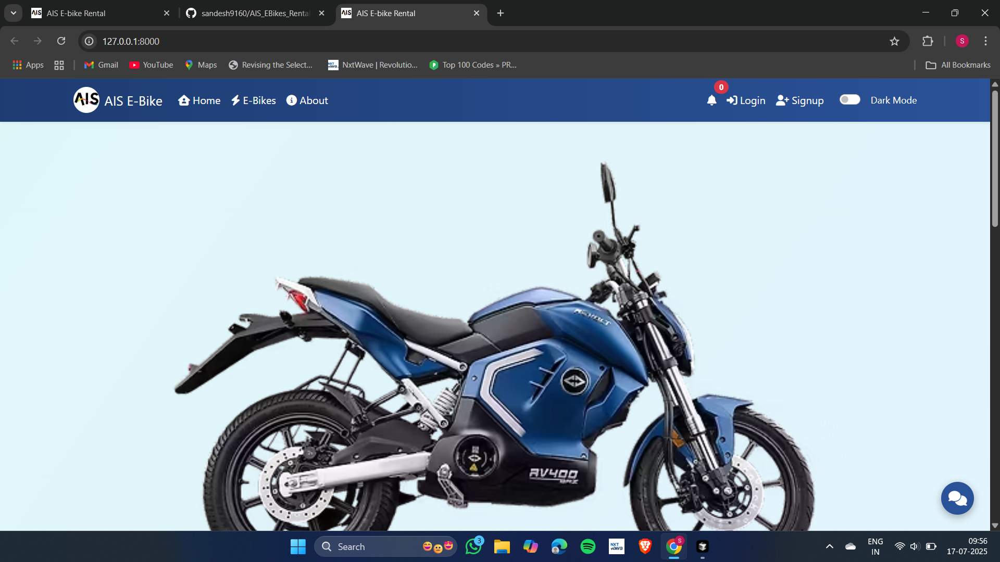

### Login Page
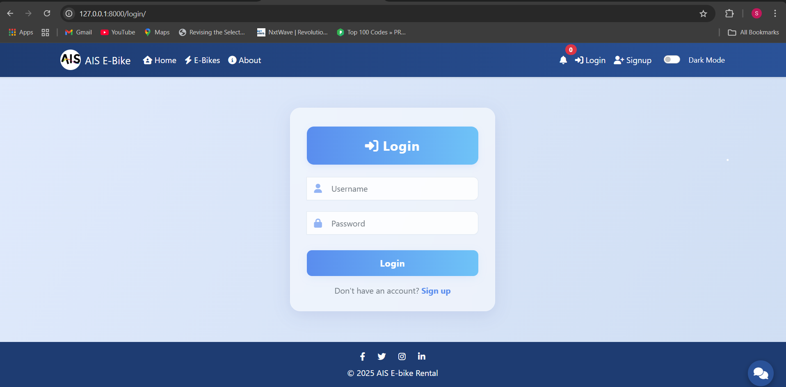

### Signup Page
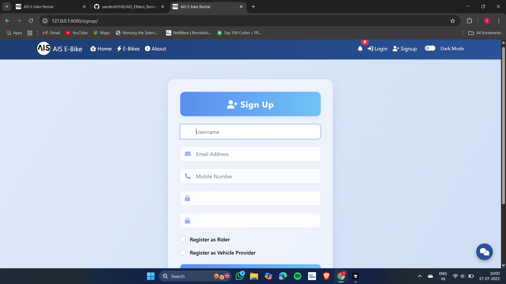

### Available E-Bikes
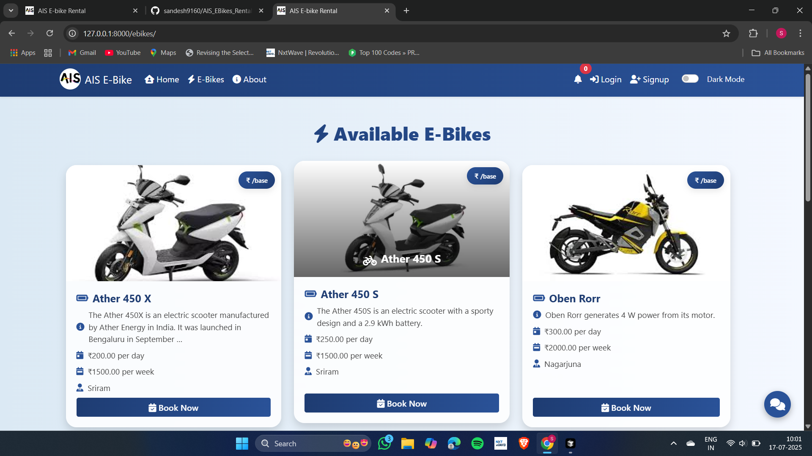

### Rider Dashboard
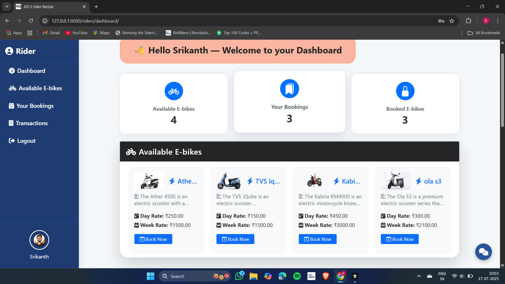
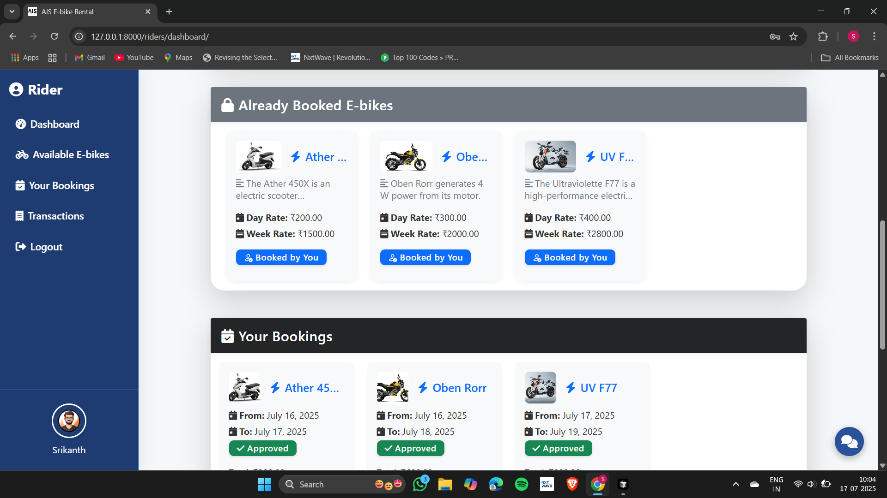
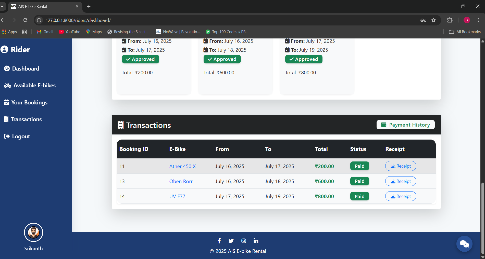

### Book E-Bike
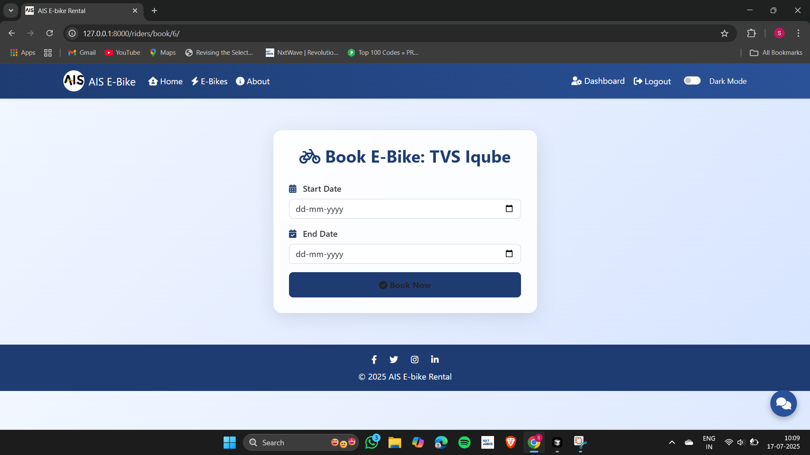

### Payment Page
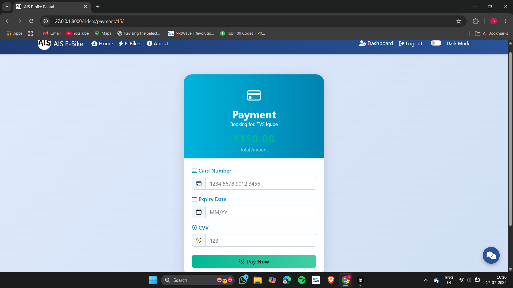

### Payment Confirmation
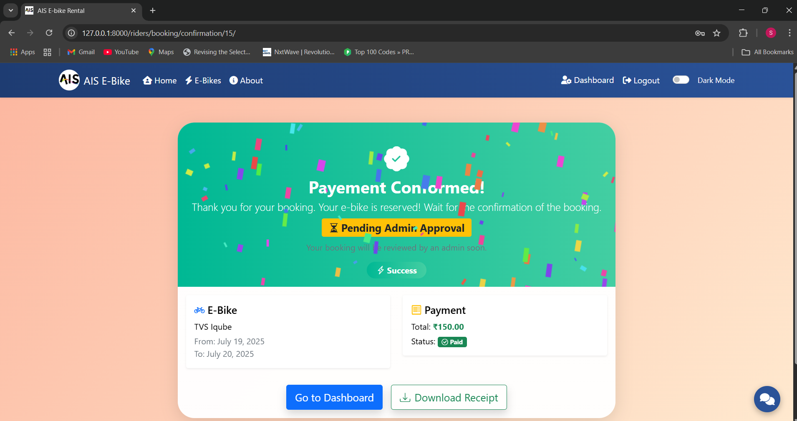

### Receipt
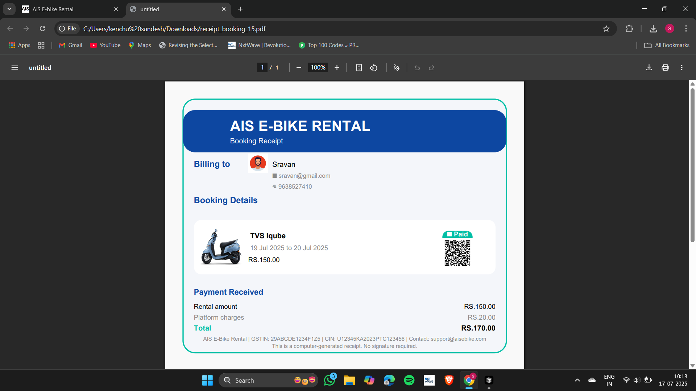

### Provider Dashboard
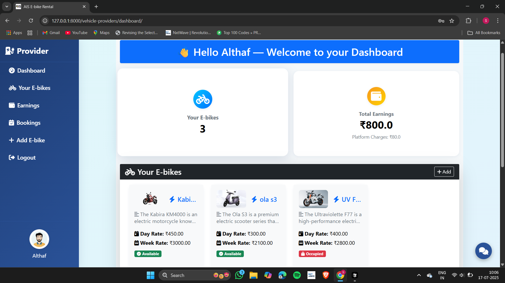
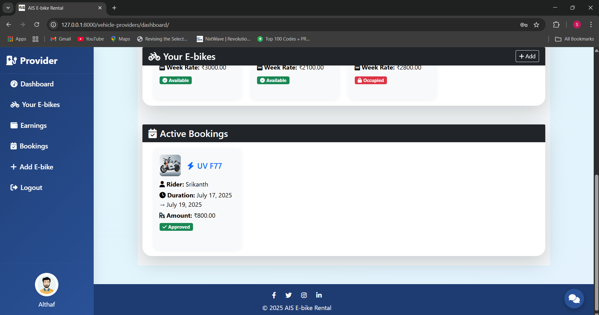

### Add E-Bike Page
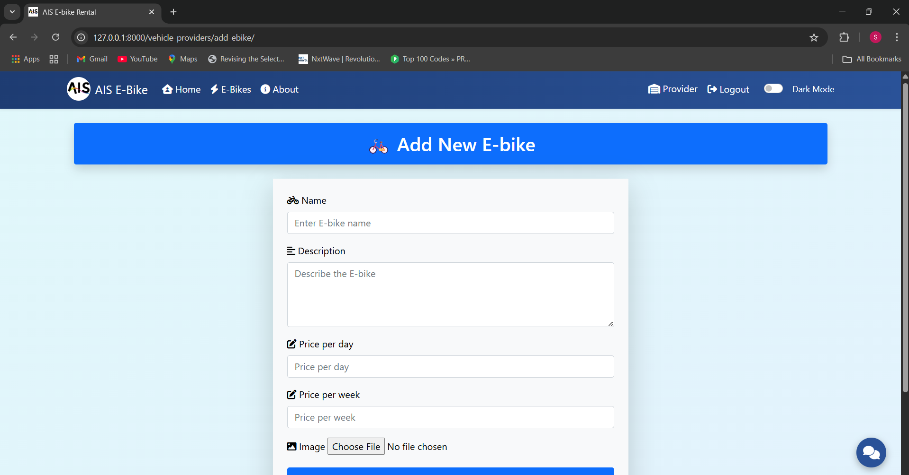

### Admin Dashboard
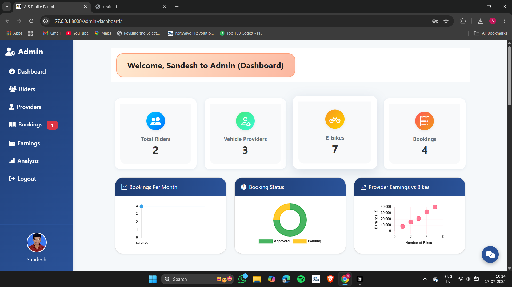
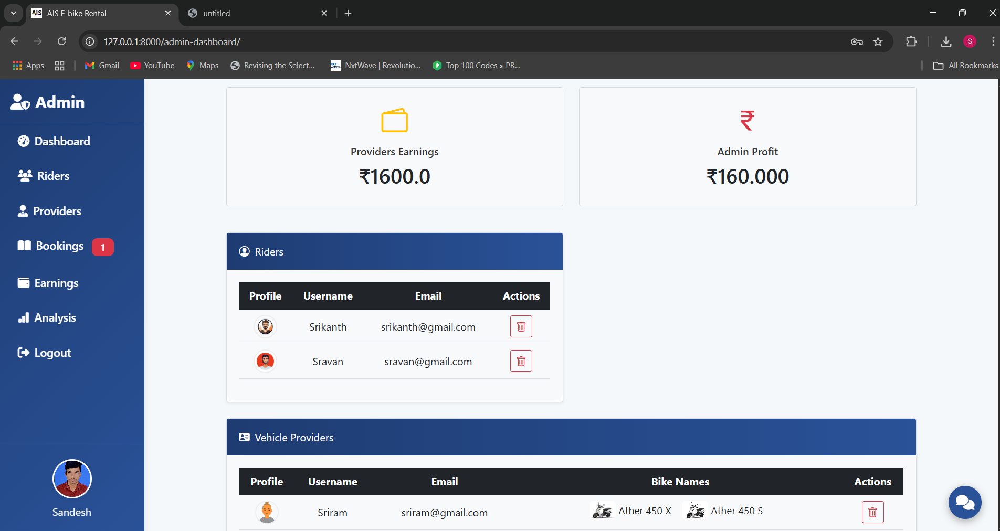
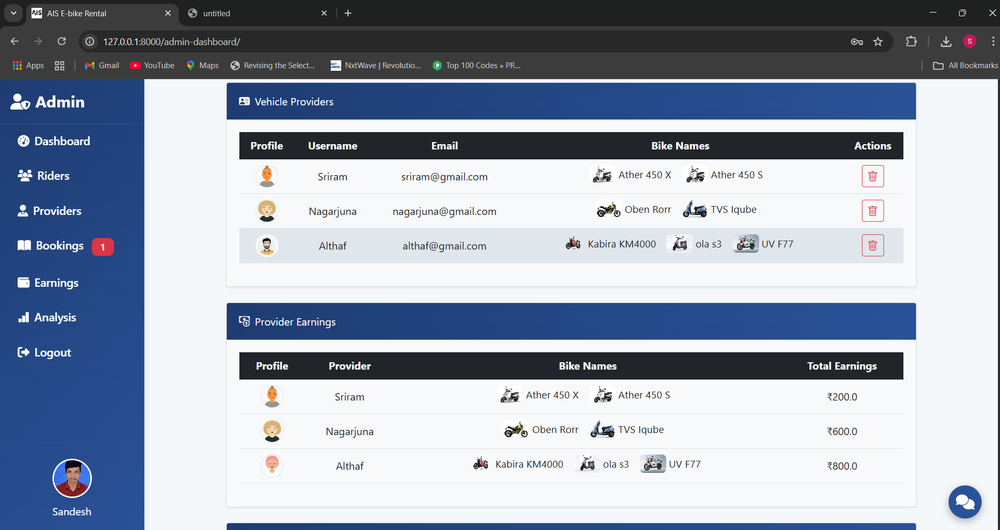
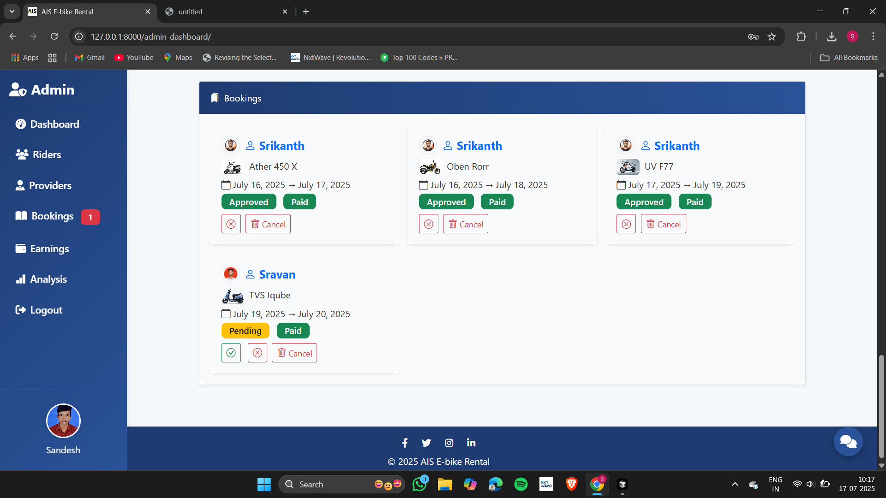

### Review Documents (Modern UI)


### Provider Details (New)


---

## 🎥 Demo GIFs

> You can drop your recordings into the `screenshots/` folder with the names below and they will render automatically.

- Admin → Provider Details flow
  
  

- Review Documents: sticky section navigation
  
  

- Profile update via AJAX modal (Admin/Rider/Provider)
  
  

---

## 🧩 Tech Stack

| Layer         | Technology           |
|---------------|---------------------|
| Frontend      | HTML, CSS, Bootstrap |
| Backend       | Python, Django       |
| Database      | MySQL               |
| Auth & Admin  | Django Admin Panel  |

---

## 🏗️ Project Modules

### 🔸 `core/`
- Home, About, Authentication (Login/Signup), Profile Management, Notifications

### 🔸 `riders/`
- Rider registration, login, dashboard, booking system, payment

### 🔸 `vehicle_providers/`
- Vehicle owner dashboard, bike upload, earnings tracker, vehicle registration

### 🔸 `admin_dashboard/`
- Admin dashboard for managing users, bookings, and vehicles
- Provider details view (`provider_detail`) for per-provider insights and actions

---

## 🧭 Application Flow

Home → Register/Login → Browse E-Bikes → Book or Upload → Dashboard → Manage & Track

---

## 🛠️ Local Setup Instructions

### ✅ Prerequisites

- Python 3.8+
- MySQL 5.7+
- Git
- pip (Python package installer)

---

### 📦 Installation

```bash
git clone https://github.com/sandesh9160/AisEbikeRental.git
cd AisEbikeRental
python -m venv venv
# On Windows:
venv\Scripts\activate
# On Mac/Linux:
source venv/bin/activate
pip install -r requirements.txt
```

---

### 🗃️ Database Setup

In MySQL:
```sql
CREATE DATABASE ais_ebikes_db;
CREATE USER 'ais_ebikes_user'@'localhost' IDENTIFIED BY 'your_password';
GRANT ALL PRIVILEGES ON ais_ebikes_db.* TO 'ais_ebikes_user'@'localhost';
FLUSH PRIVILEGES;
```

---

### 🔐 Environment Configuration

Create a `.env` file in the project root:
```
DEBUG=True
SECRET_KEY=your_secret_key
DATABASE_NAME=ais_ebikes_db
DATABASE_USER=ais_ebikes_user
DATABASE_PASSWORD=your_password
DATABASE_HOST=localhost
DATABASE_PORT=3306
```
Update `settings.py` to read from `.env`.

---

### 🔄 Migrate & Run

```bash
python manage.py makemigrations
python manage.py migrate
python manage.py createsuperuser  # Create admin account
python manage.py collectstatic    # Collect static files
python manage.py runserver
```

📍 Open: http://localhost:8000

---

## 📂 Project Structure

```
admin_dashboard/         # Admin-specific views and models
ais_ebike_rental/        # Project settings and configuration
core/                    # Core app: home, auth, profile, notifications
riders/                  # Rider-specific features
vehicle_providers/       # Vehicle provider features
media/                   # Uploaded images and documents
screenshots/             # Project screenshots for documentation
templates/               # HTML templates for all apps
  └─ admin_dashboard/
      ├─ dashboard.html               # Admin dashboard
      ├─ review_documents.html        # Review documents center (modern UI)
      └─ provider_detail.html         # Provider details (new)
requirements.txt         # Python dependencies
manage.py                # Django management script
db.sqlite3               # SQLite database (default, for development)
```

---

## 🙌 Contributing

Pull requests are welcome! For major changes, please open an issue first to discuss what you would like to change.

---

## 📄 License

[MIT](LICENSE)

---

## 🌐 Live Demo

*No live deployment yet. Run locally as described above.*

---

## ✨ Credits

Developed by Sandesh Kenchugundi and contributors.

---

For more details, see the [GitHub repository](https://github.com/sandesh9160/AisEbikeRental). 

---

## 🧭 Admin Guide (Quick Links)

- Provider Details: Admin Dashboard → Providers table → View
- Review Documents: Admin Dashboard → Document Verification or /admin-dashboard/review-documents/
- Edit Verification: From Provider Details (Approved section) → Edit; or Review Documents list.

## 💡 Tips

- Profile updates open in a modal (no page reload). On save, the sidebar name, email, mobile, and avatar update in-place.
- On the Review Documents page, use the sticky navigation to jump between Pending/Approved/Rejected sections.
